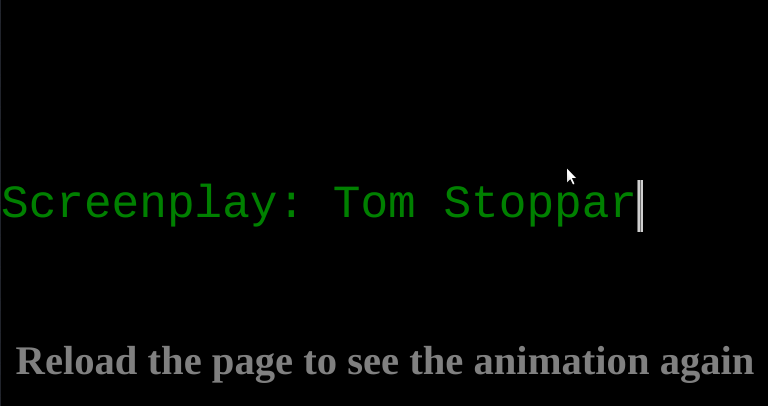

# Instructions

1. Edit the HTML file to create a credit for your favourite artist
2. Add one or more additional `
` elements with additional credits
3. In the CSS file, choose a monospace font (perhaps one you install from [Google Fonts](https://fonts.google.com))
4. Create a typewriter animation using keyframes in an `@keyframes` at-rule
5. Use a CSS custom property to define how wide each `
` element should be to display all the text it contents
6. Use `ch` units
7. Use `white-space: nowrap;`
8. Use `overflow: hidden;`
9. Place all the `
` elements in the same position
10. Use `animation-delay` to play each credits animation in order

Bonus:
1. Create a flashing cursor animation
2. Play it just enough times for each credits animation
3. Optionally, leave it flashing when all credits have been shown

